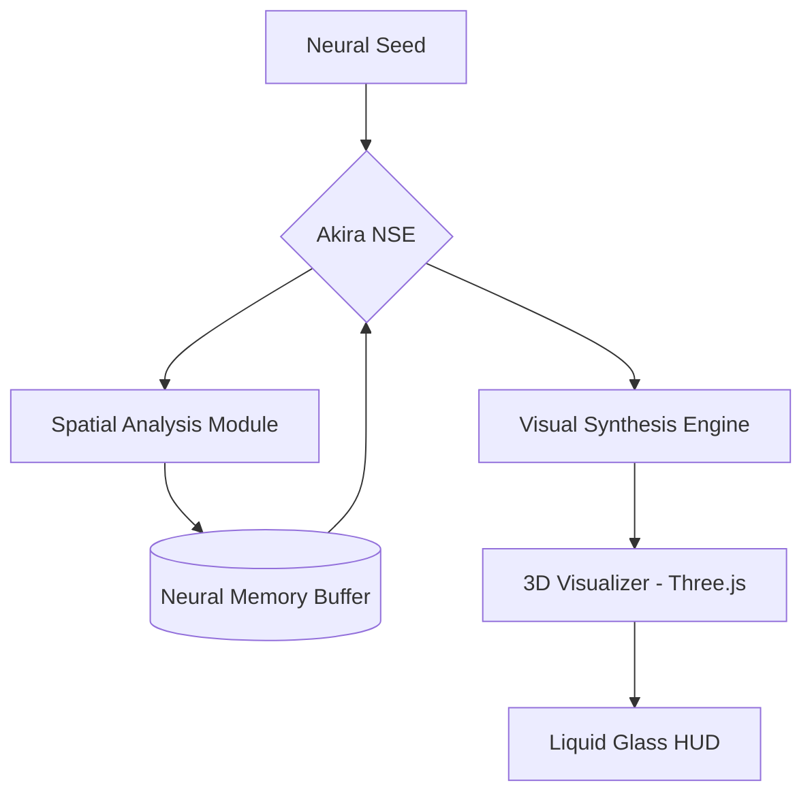

# 🌌 Akira Intelligence

<div align="center">
  
  <br />
  <p align="center">
    <b>Autonomous Neural Architectural Synthesis & Spatial Orchestration Engine</b>
  </p>
  <p align="center">
    
    
    
  </p>
</div>

---

## 🔘 Neural Vision

**Akira Intelligence** is not just a city builder; it is a **Neural Synthesis Engine** designed to bridge the gap between abstract architectural seeds and deterministic spatial reality. By leveraging advanced agentic workflows and real-time mesh synthesis, Akira autonomously reconstructs urban nexus points across five distinct evolutionary phases.

> *"The grid is alive. The architecture is synthesized. The nexus is Akira."*

---

## 🚀 Core Synthesis Modules

### 🧠 Neural Synthesis Engine (NSE)
The heart of Akira. It processes raw neural seeds into structural blueprints using high-authority LLM orchestration. 
- **Dynamic Phase Shifting**: Infrastructure → Commercial → Residential → Office → Public.
- **Topological Optimization**: Real-time spatial indexing for collision-free urban expansion.

### 💎 Liquid Glass Interface
A premium HUD (Heads-Up Display) experience inspired by high-agency industrial design.
- **Bento 2.0 Layout**: A modular dashboard providing deep-link telemetry into every synthesized unit.
- **Micro-Physics Animations**: Framer Motion-driven interactions with 100/20 spring physics.

### 🔭 Advanced 3D Visualization
High-fidelity atmospheric engine powered by Three.js.
- **Emerald Ambience**: Curated OKLCH-based color space for superior visual comfort.
- **Neural Fog & Volumetrics**: Dynamic environmental effects that scale with structural density.

---

## 🏗️ System Architecture



---

## 🛠️ Advanced Tech Stack

| Category | Technology |
| :--- | :--- |
| **Framework** | Next.js 15 (App Router), React 19 |
| **Styling** | Tailwind CSS v4, OKLCH Color Space |
| **Motion** | Framer Motion (Neural Springs) |
| **Backend** | tRPC (End-to-end Safety), Drizzle ORM |
| **Visualization** | Three.js, Phosphor Icons (Duotone) |
| **Core Utilities** | Python 3.12 (Analysis), Bash (Orchestration) |

---

## 📂 Neural Repository Structure

```text
AKIRA-INTELLIGENCE/
├── 🌿 app/              # Visual interface & hydration
├── 🧩 components/       # High-premium UI & HUD modules
│   └── ui/              # Liquid Glass atomic components
├── ⚡ core/             # Neural Synthesis Logic
│   ├── analysis/        # Spatial & topological validation
│   └── engine/          # Python-based processing cores
├── �️ lib/              # Neural constants & session guards
├── 🛰️ scripts/          # Shell-based Nexus orchestration
└── 🎨 public/           # Unified branding & assets
```

---

## 🏁 Accelerated Onboarding

### 1. Synchronize Environment
Prepare the local node for neural link.
```bash
git clone https://github.com/Akira-Intelligence/Nexus.git
cd Akira-Intelligence
chmod +x scripts/*.sh
./scripts/init_nexus.sh
```

### 2. Ignition
Start the dev instance of the Synthesis Engine.
```bash
npm install
npm run dev
```

### 3. Verification
Verify neural link at `http://localhost:3000`. Use access key `COGNITECT2024` for manual mode.

---

## 🛡️ Cognitect Security Protocols

Every synthesis operation is protected by the **Akira Shield**:
1. **Access Decryption**: Manual link requires a verified 256-bit rotating key.
2. **Neural Buffer Isolation**: Synthesis logs are isolated from public network streams.
3. **QA Validation**: Every structural unit is audited by the `Akira (QA)` subagent before synchronization.

---

## 🗺️ Synthesis Roadmap

- [x] **Phase 1**: Core Neural Grid Implementation
- [x] **Phase 2**: Liquid Glass UI Overhaul
- [x] **Phase 3**: Radial Spoke Layout Optimization
- [ ] **Phase 4**: Real-time Collaborative Nexus (Multi-Link)
- [ ] **Phase 5**: VR/AR Spatial Immersive Interface

---

<div align="center">
  <p><b>Developed by Advanced Agentic Design Team</b></p>
  <p>© 2026 Akira Intelligence. Proprietary Nexus Technology.</p>
</div>
